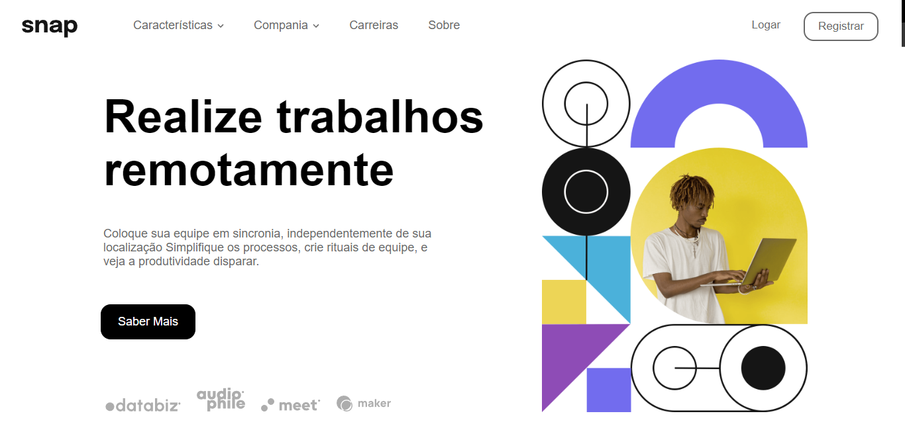
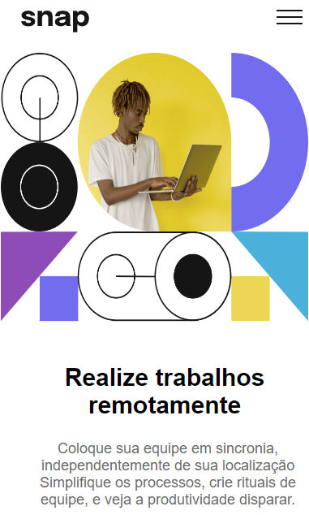

# Desafio - Frontend Mentor

## Bem-vindo! 👋

Obrigado por olhar este desafio de codificação de front-end.

[Frontend Mentor](https://www.frontendmentor.io) ajuda você a melhorar suas habilidades de codificação criando projetos realistas.

**Para fazer este desafio, foi necessário ter conhecimentos de HTML, CSS e JavaScript..**

## O Desafio

Meu desafio foi construir esta seção de introdução com navegação suspensa e deixá-la o mais próximo do design da imagem acima.

Eu pude usar qualquer ferramenta que desejasse para concluir o desafio.

Meus usuários devem ser capazes de:

- Visualizar os menus suspensos relevantes no computador e no celular ao interagir com os links de navegação
- Visualizar o layout ideal para o conteúdo, dependendo do tamanho da tela do dispositivo
- Veja os estados de foco para todos os elementos interativos na página

## Onde encontrar os arquivos

Minha tarefa é construir o projeto para os designs dentro da pasta `/design`. Você encontrará uma versão móvel e uma versão para desktop do design.

Os designs estão no formato estático JPG. O uso de JPGs significa que você precisará usar seu melhor julgamento para estilos como `font-size`, `padding` e `margin `.

Você encontrará todas as imagens e ícones necessários na pasta `/images`. Os recursos já estão otimizados.

Há também um `style-guide.md` arquivo contendo as informações necessárias, como paleta de cores e fontes.

O arquivo principal `index.html` está com todo o html existente na página, e `styles.css` com todo o css da página, por último o `script.js` com o JavaScript.

## O que eu aprendi

Neste projeto coloquei meu aprendizado com html, css e JavaScript em prática, o Media Query (adaptação da tela) dentro do css foi a parte mais trabalhosa, nunca tive contato com esse tipo de estilização.

As condição em JavaScritps foi sem dúvidas a parte que eu estive mais familiarizado, veje um exemplo a baixo:

btnMenu.addEventListener("click", () => {
if (menu.style.display == "flex") {
menu.style.display = "none"
} else {
menu.style.display = "flex"
menuClose.style.display = "block"
}
})

O `btnMenu` vai ser acionado com um click, e se menu estiver visível (`diplay: flex;`) ele se tornara invisível (`display; none;`), com isso o Menu se abre e fecha.

Preciso melhorar minhas aplicações em css, mas como um dos primeiros projetos estou feliz com esse resultado.

# Resultado final

## Home page do Desktop

## Home page mobile

## Página inicial Menu

## Autor

Nome - Gabriel Suenaga

Email - gabriel.hneus@gmail.com

Twitter - [@amo_pobres](https://twitter.com/amo_pobre)

Site - (**Portfólio em breve**)

## Tem algum feedback ?

Adoro receber feedback! Estou sempre buscando melhorar meus projetos. Portanto, se você tiver algo que gostaria de mencionar, envie um e-mail ou mensagem para mim.

Este projeto é totalmente aberto. Por favor, compartilhe com qualquer pessoa que achará útil.

**Divirta-se programando!** 🚀
